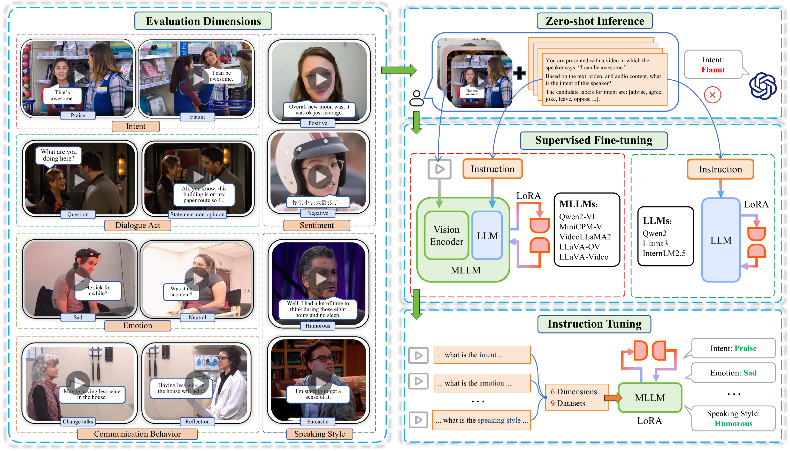

# Can Large Language Models Help Multimodal Language Analysis? MMLA: A Comprehensive Benchmark


> Multimodal language analysis is a rapidly evolving field that leverages multiple modalities to enhance the understanding of high-level semantics underlying human conversational utterances. Despite its significance, little research has investigated the capability of multimodal large language models (MLLMs) to comprehend cognitive-level semantics. In this paper, we introduce MMLA, a comprehensive benchmark specifically designed to address this gap. MMLA comprises over 61K multimodal utterances drawn from both staged and real-world scenarios, covering six core dimensions of multimodal semantics: intent, emotion, dialogue act, sentiment, speaking style, and communication behavior. We evaluate eight mainstream branches of LLMs and MLLMs using three methods: zero-shot inference, supervised fine-tuning, and instruction tuning. Extensive experiments reveal that even fine-tuned models achieve only about 60%~70% accuracy, underscoring the limitations of current MLLMs in understanding complex human language. We believe that MMLA will serve as a solid foundation for exploring the potential of large language models in multimodal language analysis and provide valuable resources to advance this field.


## Updates
- **[2025.04.29]**: 🔥 🔥 🔥 The datasets of the MMLA benchmark are released on [Huggingface](https://huggingface.co/datasets/THUIAR/MMLA-Datasets)! The code will be released soon.
- **[2025.04.24]**: 📜 Our paper: **Can Large Language Models Help Multimodal Language Analysis? MMLA: A Comprehensive Benchmark** is released ([arXiv](https://arxiv.org/abs/2504.16427), [Huggingface](https://huggingface.co/papers/2504.16427), [alphaXiv](https://www.alphaxiv.org/abs/2504.16427)). The official repo is released on Github.

## Overview of the MMLA Benchmark 

### Highlights
- **Various Sources**: 9 datasets, 61K+ samples, 3 modalities, 76.6 videos. Both acting and real-world scenarios (Films, TV series, YouTube, Vimeo, Bilibili, TED, Improvised scripts, etc.).
- **6 Core semantic Dimensions**: Intent, Emotion, Sentiment, Dialogue Act, Speaking Style, and Communication Behavior.
- **3 Evaluation Methods**: Zero-shot Inference, Supervised Fine-tuning, and Instruction Tuning.
- **8 Mainstream Foundation Models**: 5 MLLMs (Qwen2-VL, VideoLLaMA2, LLaVA-Video, LLaVA-OV, MiniCPM-V-2.6), 3 LLMs (InternLM2.5, Qwen2, LLaMA3).

------
<div style="display: flex; justify-content: space-between;">
    
    
    
</div>

## Evaluation Datasets

|       Dimension        |       Dataset       |                            Source                            |                 Venue                  |
| :--------------------: | :-----------------: | :----------------------------------------------------------: | :------------------------------------: |
|         Intent         |       MIntRec       | [Paper](https://dl.acm.org/doi/10.1145/3503161.3547906) / [GitHub](https://github.com/thuiar/MIntRec) |                ACM MM 2022                |
|         Intent         |     MIntRec2.0      | [Paper](https://arxiv.org/abs/2403.10943) / [GitHub](https://github.com/thuiar/MIntRec2.0) |               ICLR 2024                |
|        Emotion         |        MELD         | [Paper](https://aclanthology.org/P19-1050/) / [GitHub](https://affective-meld.github.io/) |                ACL 2019                |
|        Emotion         |       IEMOCAP       | [Paper](https://link.springer.com/article/10.1007/S10579-008-9076-6) / [Website](https://sail.usc.edu/iemocap/) | Language Resources <br>and Evaluation 2008 |
|      Dialogue Act      |       MELD-DA       | [Paper](https://aclanthology.org/2020.acl-main.402/) / [GitHub](https://github.com/sahatulika15/EMOTyDA) |                ACL 2020                |
|      Dialogue Act      |     IEMOCAP-DA      | [Paper](https://aclanthology.org/2020.acl-main.402/) / [Website](https://github.com/sahatulika15/EMOTyDA) |                ACL 2020                |
|       Sentiment        |        MOSI         | [Paper](https://ieeexplore.ieee.org/document/7742221) / [GitHub](https://github.com/CMU-MultiComp-Lab/CMU-MultimodalSDK) |     IEEE Intelligent<br> Systems 2016   |
|       Sentiment        |    CH-SIMS v2.0     | [Paper](https://arxiv.org/abs/2209.02604) / [GitHub](https://github.com/thuiar/ch-sims-v2) |               ICMI 2022                |
|     Speaking Style     |     UR-FUNNY-v2     | [Paper](https://aclanthology.org/D19-1211/) / [GitHub](https://github.com/ROC-HCI/UR-FUNNY) |                ACL 2019                |
|     Speaking Style     |       MUStARD       | [Paper](https://aclanthology.org/P19-1455/) / [GitHub](https://github.com/Himanshu-sudo/MUStARD-dataset) |                ACL 2019                |
| Communication Behavior |  Anno-MI (client)   | [Paper ](https://doi.org/10.3390/fi15030110)/ [GitHub](https://github.com/uccollab/AnnoMI) |          ICASSP 2022          |
| Communication Behavior | Anno-MI (therapist) | [Paper](https://doi.org/10.3390/fi15030110) / [GitHub](https://github.com/uccollab/AnnoMI) |          ICASSP 2022         |

The raw text and videos of each dataset all released on [Huggingface](https://huggingface.co/datasets/THUIAR/MMLA-Datasets). Note that for MOSI, IEMOCAP, and IEMOCAP-DA datasets, we only provide the raw texts due to their restricted license. The raw videos of IEMOCAP can be downloaded from [here](https://sail.usc.edu/iemocap/iemocap_release.htm). The MOSI dataset cannot be released due to the privacy limitation as mentioned in [CMU-MultimodalSDK](https://github.com/CMU-MultiComp-Lab/CMU-MultimodalSDK).

## Evaluation Models

|        Models         |                     Model scale and Link                     |                            Source                            | Type |
| :-------------------: | :----------------------------------------------------------: | :----------------------------------------------------------: | :--: |
|    Qwen2     | 🤗 [0.5B](https://huggingface.co/Qwen/Qwen2-0.5B-Instruct) / [1.5B](https://huggingface.co/Qwen/Qwen2-1.5B-Instruct) / [7B](https://huggingface.co/Qwen/Qwen2-7B-Instruct) | [Paper](https://arxiv.org/html/2407.10671v4)  / [ GitHub](https://github.com/QwenLM/Qwen2.5) | LLM  |
|    Llama3    | 🤗 [8B ](https://huggingface.co/PartAI/Dorna-Llama3-8B-Instruct) | [Paper](https://arxiv.org/abs/2407.21783) / [GitHub](https://github.com/meta-llama/llama-models/) | LLM  |
|   InternLM2.5    | 🤗 [7B](https://huggingface.co/internlm/internlm2_5-7b-chat)  | [Paper](https://arxiv.org/abs/2403.17297) / [GitHub](https://github.com/InternLM/InternLM) | LLM  |
|      VideoLLaMA2      |  🤗 [7B](https://huggingface.co/DAMO-NLP-SG/VideoLLaMA2-7B)   | [Paper](https://arxiv.org/abs/2406.07476) / [GitHub](https://github.com/DAMO-NLP-SG/VideoLLaMA2) | MLLM |
|   Qwen2-VL   | 🤗 [7B](https://huggingface.co/Qwen/Qwen2-VL-72B-Instruct) / [72B](https://huggingface.co/Qwen/Qwen2-VL-72B-Instruct) | [Paper](https://arxiv.org/abs/2409.12191) / [GitHub](https://github.com/QwenLM/Qwen2.5-VL) | MLLM |
|      LLaVA-Video      | 🤗 [7B](https://huggingface.co/lmms-lab/LLaVA-Video-7B-Qwen2) / [72B](https://huggingface.co/lmms-lab/LLaVA-Video-72B-Qwen2) | [Paper](https://arxiv.org/abs/2410.02713) / [GitHub](https://github.com/LLaVA-VL/LLaVA-NeXT?tab=readme-ov-file) | MLLM |
| LLaVA-OneVision | 🤗 [7B](https://huggingface.co/lmms-lab/llava-onevision-qwen2-7b-ov-chat) / [72B](https://huggingface.co/lmms-lab/llava-onevision-qwen2-72b-ov-chat) | [Paper](https://arxiv.org/abs/2408.03326) / [GitHub](https://github.com/LLaVA-VL/LLaVA-NeXT?tab=readme-ov-file) | MLLM |
|     MiniCPM-V-2.6     |     🤗 [8B](https://huggingface.co/openbmb/MiniCPM-V-2_6)     | [Paper](https://arxiv.org/abs/2408.01800) / [GitHub](https://github.com/OpenBMB/MiniCPM-o) | MLLM |

## Evaluation Results

### LeaderBoard

####  Rank of Zero-shot Inference

| RANK |      Models      |  ACC  | TYPE |
| :--: | :--------------: | :---: | :--: |
|  🥇   |      GPT-4o      | 52.60 | MLLM |
|  🥈   |   Qwen2-VL-72B   | 52.55 | MLLM |
|  🥉   |   LLaVA-OV-72B   | 52.44 | MLLM |
|  4   | LLaVA-Video-72B  | 51.64 | MLLM |
|  5   |  InternLM2.5-7B  | 50.28 | LLM  |
|  6   |     Qwen2-7B     | 48.45 | LLM  |
|  7   |   Qwen2-VL-7B    | 47.12 | MLLM |
|  8   |    Llama3-8B     | 44.06 | LLM  |
|  9   |  LLaVA-Video-7B  | 43.32 | MLLM |
|  10  |  VideoLLaMA2-7B  | 42.82 | MLLM |
|  11  |   LLaVA-OV-7B    | 40.65 | MLLM |
|  12  |    Qwen2-1.5B    | 40.61 | LLM  |
|  13  | MiniCPM-V-2.6-8B | 37.03 | MLLM |
|  14  |    Qwen2-0.5B    | 22.14 | LLM  |

#### Rank of Supervised Fine-tuning (SFT) and Instruction Tuning (IT)

| Rank |         Models         |  ACC  | Type |
| :--: | :--------------------: | :---: | :--: |
|  🥇   |   Qwen2-VL-72B (SFT)   | 69.18 | MLLM |
|  🥈   | MiniCPM-V-2.6-8B (SFT) | 68.88 | MLLM |
|  🥉   |  LLaVA-Video-72B (IT)  | 68.87 | MLLM |
|  4   |   LLaVA-ov-72B (SFT)   | 68.67 | MLLM |
|  5   |   Qwen2-VL-72B (IT)    | 68.64 | MLLM |
|  6   | LLaVA-Video-72B (SFT)  | 68.44 | MLLM |
|  7   |  VideoLLaMA2-7B (SFT)  | 68.30 | MLLM |
|  8   |   Qwen2-VL-7B (SFT)    | 67.60 | MLLM |
|  9   |   LLaVA-ov-7B (SFT)    | 67.54 | MLLM |
|  10  |  LLaVA-Video-7B (SFT)  | 67.47 | MLLM |
|  11  |    Qwen2-VL-7B (IT)    | 67.34 | MLLM |
|  12  | MiniCPM-V-2.6-8B (IT)  | 67.25 | MLLM |
|  13  |    Llama-3-8B (SFT)    | 66.18 | LLM  |
|  14  |     Qwen2-7B (SFT)     | 66.15 | LLM  |
|  15  | Internlm-2.5-7B (SFT)  | 65.72 | LLM  |
|  16  |     Qwen-2-7B (IT)     | 64.58 | LLM  |
|  17  |  Internlm-2.5-7B (IT)  | 64.41 | LLM  |
|  18  |    Llama-3-8B (IT)     | 64.16 | LLM  |
|  19  |    Qwen2-1.5B (SFT)    | 64.00 | LLM  |
|  20  |    Qwen2-0.5B (SFT)    | 62.80 | LLM  |

### Fine-grained Performance on Each Dimension

We show the results of three evaluation methods (i.e., zero-shot inference, SFT, and IT). The performance of state-of-the-art multimodal machine learning methods and GPT-4o is also shown in the figure below.

#### Zero-shot Inference and Supervised Fine-tuning (SFT)


#### Instruction Tuning (IT)


**To do: the code of zero-shot inference, SFT, and IT will be released soon.**

## Acknowledgements 

If our work is helpful to your research, please **give us a star 🌟** and **cite** the following paper: 

```
@article{zhang2025mmla,
  author={Zhang, Hanlei and Li, Zhuohang and Zhu, Yeshuang and Xu, Hua and Wang, Peiwu and Zhu, Haige and Zhou, Jie and Zhang, Jinchao},
  title={Can Large Language Models Help Multimodal Language Analysis? MMLA: A Comprehensive Benchmark},
  year={2025},
  journal={arXiv preprint arXiv:2504.16427},
}
```
